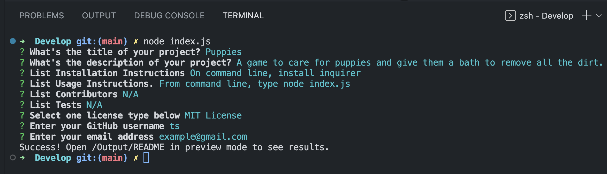

# generate-readme

## Description
 Generate a professional README file using command line input from the user.

## Table of Contents

[Installation](#installation)

[Usage](#usage)

[Contributors](#contributors)

[License](#license)

[Questions](#questions)

## Installation
 In directory containing index.js, right click file, choose "Open In Integrated Terminal" 
 On command line, type:
    npm install -y
    npm install inquirer
    npm index.js
       Answer all the user prompts

## Usage
The entry file is index.js
To generate a README file, type on command line:
   npm index.js
      Answer user prompts
      View created README.md in /Output dir. Choose "Open Preview" to view

## Video
[Click here for Video demonstration](https://youtu.be/F_ckcr0KID0)

## Screenshots
### Example User Input

### Example README file

## Contributors
 URL links for Licenses: https://gist.github.com/lukas-h/2a5d00690736b4c3a7ba

 Corrado Alfano - tutor

## License
N/A

## Questions
Link to GitHub repository: https://github.com/tasshroll/generate-README

Contact me with additional questions at tasshrollj@gmail.com